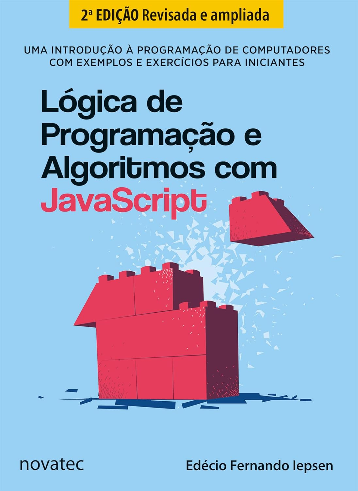

# Livro-JavaScript

## Lógica de Programação e Algoritmos com JavaScript

Repositório contendo os algoritmos de JavaScript abordados neste livro. 
Fonte de estudo e aprofundamento da linguagem JavaScript. 

Além disso, destaca-se que estou padronizando os commits, criando branchs de cada capítulo e posteriomente mesclando na raiz main do projeto. 

- Cap 01. Introdução (Pág. 11 a 40)
- ...

## Tecnologias utilizadas

### JavaScript

### [Padrões de Commit](https://github.com/iuricode/padroes-de-commits)

<b>Versão 1.0.0</b>
